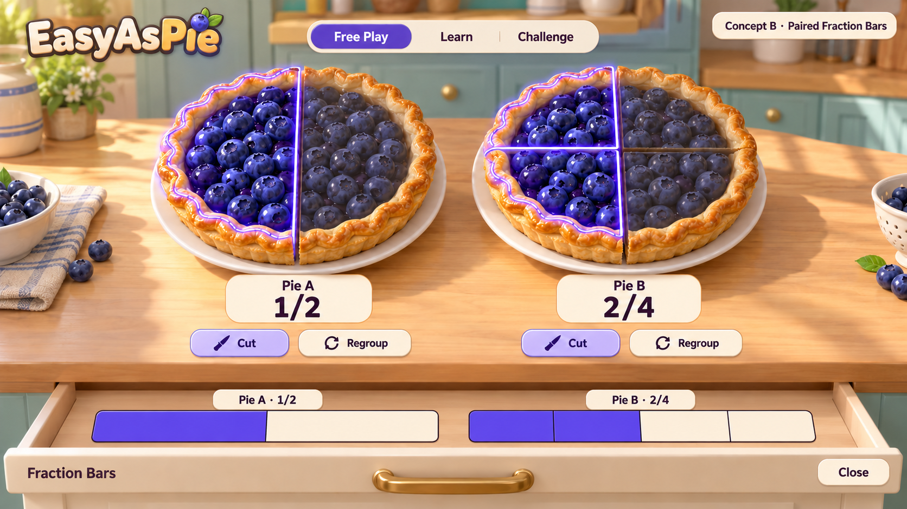

# Free Play Implementation Plan

Planning baseline: September 28, 2026. This document splits [issue #7](https://github.com/AbbyUsesAIThatCodes/EasyAsPie/issues/7) into five implementation issues, with teacher-requested visual milestone **03A / #18** inserted after #11 and before #12. Consult the current status for completed work; this sequence does not imply visual acceptance.

## Preserved Visual Reference

The teacher supplied this exact image on September 28, 2026 and described it as very close to the finished program they want. It is a concept mockup, not a screenshot of the current game. Preserve the large equal-sized blueberry pies, warm kitchen and wooden counter, golden crusts, cream panels, berry-purple selected portions, compact mode navigation, readable fractions, and one labeled bar beneath each pie in an opening drawer.

The image is a visual target. Real controls, hover/focus outlines, zero servings, sixteenths, accessibility, and the full build identifier must still follow the interaction requirements; the concept label at upper right is not a required product feature. Do not trade countable equal subdivisions for decoration. Keep equal-length bars and one common pie slice origin even where an illustrative camera angle is approximate.

- Original supplied filename: `ChatGPT Image Sep 28, 2026, 06_09_12 PM.png`.
- Repository copy: `docs/mockups/paired-fraction-bars.png`.
- Preserved without pixel edits or recompression: 1672 × 941 PNG, 2,932,253 bytes.
- SHA-256: `4769da5dc93a091b6b0e1f8b6457a3ada7ba96ffe97a94b16f354065f8983969`.

## Source Priority And Recovery

1. The teacher's latest decisions and reviewed changes govern the work.
2. The [preserved discussion's Current Direction](DESIGN-DISCUSSION-2026-09-28.md#current-direction) records the agreed redesign. PR #8 merged that discussion into main.
3. Issue #7 and its ordered children define this Free Play increment. Their bodies are the current task checklist; this file preserves the intended sequence and shared contract.
4. [DESIGN](DESIGN.md), [CURRICULUM](CURRICULUM.md), and [TEACHER](TEACHER.md) still contain first-playable descriptions. Update affected sections as replacement behavior becomes real; preserve historical evidence.

The original #7 referenced an unfinished `docs/paired-pie-bar-redesign` foundation and a mockup path absent from that branch and main at planning time. There is no additional foundation PR to wait for. This planning/reference PR preserves the supplied image and the ordered handoff; do not resume the abandoned branch or overwrite the merged discussion. After this PR merges, begin #9 from current main.

The local EAP-01/EAP-02/EAP-04 identifiers mentioned in the old issue were not defined in the current curriculum document. Treat them as unestablished design labels, not verified goals. The documented connections remain DM 1.3 G10/G12 and prerequisites for G11, with audit-local provenance and the limits recorded in CURRICULUM. Reference the [current DM Activity 1.3](https://github.com/AbbyUsesAIThatCodes/DesignAndModeling26-27/tree/main/units/01-introduction-to-design/1.3-measuring-matters) throughout implementation. Do not copy restricted PLTW PDFs or source content into this public game repository.

## Reviewable Increments

| Order | Issue | Bounded Outcome | Stop Before |
| --- | --- | --- | --- |
| 1 | [#9 — Exact Free Play State](https://github.com/AbbyUsesAIThatCodes/EasyAsPie/issues/9) | Rendering-independent A/B state, exact actions, meaningful tests, and a written action contract | Replacing the scene or adding new UI |
| 2 | [#10 — Bakery Scene And Drawer](https://github.com/AbbyUsesAIThatCodes/EasyAsPie/issues/10) | Mockup-informed 3D composition, state-derived pie/bar displays, working accessible drawer, and compact mode shell | Live serving input or Cut/Regroup animation |
| 3 | [#11 — Linked Selection](https://github.com/AbbyUsesAIThatCodes/EasyAsPie/issues/11) | Bidirectional selection, independent pairs, Clear/Decrease/Increase, and corresponding hover/focus | Transformation animations or assessment feedback |
| 3A | [#18 — Full 3D Bakery](https://github.com/AbbyUsesAIThatCodes/EasyAsPie/issues/18) | One lit 3D scene, closed movable wedge solids, spatial drawer and bars, screenshots AND a short running-game video | Cut/Regroup gameplay or declaring teacher visual acceptance |
| 4 | [#12 — Cut And Regroup](https://github.com/AbbyUsesAIThatCodes/EasyAsPie/issues/12) | Physical 3D slicing and regrouping, exact synchronized transitions, refusal explanations, interruption policy, reduced motion, screenshots AND video | Lessons, questions, or new recipes |
| 5 | [#13 — Classroom Free Play Review](https://github.com/AbbyUsesAIThatCodes/EasyAsPie/issues/13) | Bounded integration/presentation fixes, final evidence, and accurate current documentation | A new redesign or Learn/Challenge implementation |

Step 01 retains the existing playable. Step 02 deliberately introduces a clearly labeled visual preview, with deferred controls and modes honestly unavailable. Step 03 adds serving interaction. The teacher’s September 28 review then inserted Step 03A: the initial scene looked too flat compared with Concept B. It requires actual-game screenshots and video, followed by an explicit teacher visual decision before acceptance. Step 04 completes the Free Play mathematical actions. Step 05 verifies the full original scope. Each increment must build and remain reviewable even when later features are not yet available.

Use **Free Play**, **Learn**, and **Challenge** for the current shell, consistent with #7 and the mockup; the preserved discussion also calls the first mode **Free**. Do not interpret the presence of three mode buttons as completion of three modes. Prediction before revealing a result remains an agreed requirement for future Learn/Challenge work; Free Play stays freely exploratory.

## Mathematical And Interaction Contract

- Each independent pair has one exact `{n,d}` state, with d in 2, 4, 8, 16 and n from 0 through d. There are 34 valid states per pair. Rendering does not decide answers.
- Selecting the kth slice or segment selects the first k pieces. The pie, bar, and fraction labels update from the same state. Hover/focus outlines the corresponding piece without committing a serving.
- Clear sets n to zero without changing d. Decrease/Increase respect 0..d. The fraction notation counts selected pieces over pieces in the whole; do not silently simplify it.
- Cut doubles n and d, stopping at sixteenths. Regroup halves both only when n is even and d > 2. Neither changes the amount. An impossible conversion such as 3/16 into whole eighths is explained and leaves state unchanged.
- Both pies have equal dimensions, projection, and slice origin. Both bars have equal total length; each bar's subdivisions match its pie. The bars contain no inch/centimeter units or measurement ticks.
- Repeated/interrupted input, drawer transitions, supported camera actions, and resizing cannot desynchronize a pair. Reduced motion must convey the same state and meaning.
- Accessible control names, visible focus, keyboard alternatives, and non-color feedback belong in the PR that introduces the relevant behavior.

## Requirement Coverage

| Original #7 Requirement | Main Owner | Verification |
| --- | --- | --- |
| Exact independent pair states and counts | #9 | Exhaustive valid states, boundaries, pair independence |
| Bright 3D blueberry bakery and segmented drawer bars | #10 foundation; #18 visual replacement | Actual laptop screenshots, short video, comparison with this mockup, and teacher decision |
| Common origins, equal wholes, and equal bar lengths | #10, maintained by #11/#12 | Zero/whole and countable sixteenths |
| Bidirectional serving selection and hover/focus | #11 | Both directions, all counts, focus without state mutation |
| Clear/Decrease/Increase and fraction labels | #11 | Pointer/keyboard parity and bounded counts |
| Exact Cut/Regroup and refusal feedback | #9 core; #12 UI | Preserved amount, 3/16 refusal, and interruption cases |
| Compact mode shell with truthful deferred modes | #10 | No false claim that redesigned Learn/Challenge exists |
| Keyboard, non-color feedback, and reduced motion | Every relevant PR; #13 integrates | Complete accessible workflow |
| Existing pipeline, reservations, and full build identity | Every implementation PR | Required checks and consistent console/artifact/manifest/UI/report |
| 1366 × 768 and 1280 × 720 review | Every visual PR; #13 integrates | Screenshots, no clipping, visible pies/bars/build ID |
| Teacher documentation and original scope closure | #13 | Evidence matrix, current behavior, explicit limitations |

## Handoff And Recovery Rules

1. One new conversation handles one child issue and opens one PR targeting main. The PR body uses `Closes #N` for that child. Do not implement the next child while waiting for review.
2. Review and merge that PR before starting the next conversation. Refresh main and read the merged PR, teacher decisions, parent checklist, and the next issue again. Do not build a stack on stale branches.
3. Starting with #9, keep `docs/IMPLEMENTATION_STATUS.md` concise: completed behavior, known gaps, decisions, test/build evidence, and the next issue. Include an exact build ID when a review build exists; never invent one for planning-only work.
4. Save meaningful progress in reviewable commits. If work is interrupted, use the existing branch/PR and handoff to resume the same issue rather than creating a second conflicting implementation.
5. If review changes later work, update the affected issue and parent checklist before handing it off. Preserve unfinished acceptance requirements or explicitly move them to a named issue; do not silently narrow the definition of complete.
6. Reuse earlier valid evidence; run required repository checks and test changed behavior or concrete remaining risks. Be candid about untested classroom hardware/projectors.
7. Leave merge to the teacher. Do not enable auto-merge or manually trigger deployment. The existing main-merge Pages workflow remains unchanged.
8. The final PR closes #13 and also #7 only after all original Free Play acceptance requirements are satisfied. Learn/Challenge planning follows separately after teacher review of the shared foundation.

The original planning PR changed no runtime or build configuration. Current implementation and exact review artifacts are recorded in [Implementation Status](IMPLEMENTATION_STATUS.md). Preserve the accepted version policy, durable ledger, and existing deployment workflow through each implementation increment.
