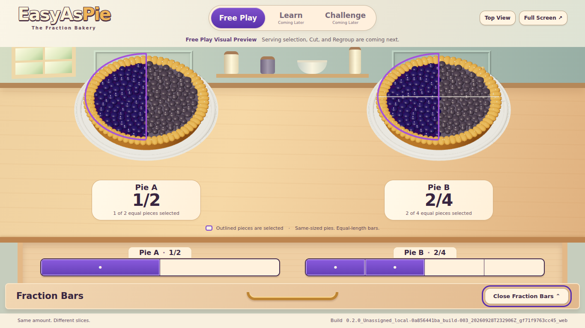
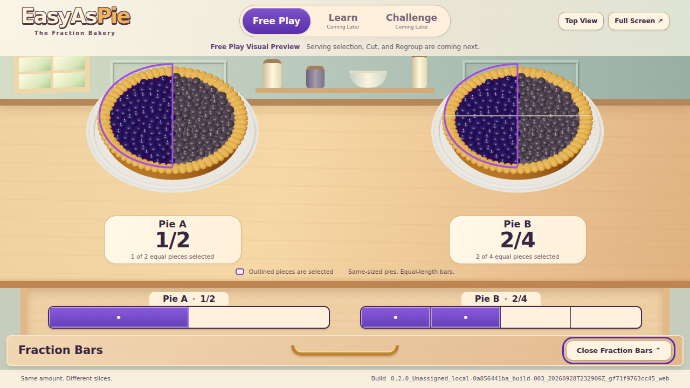
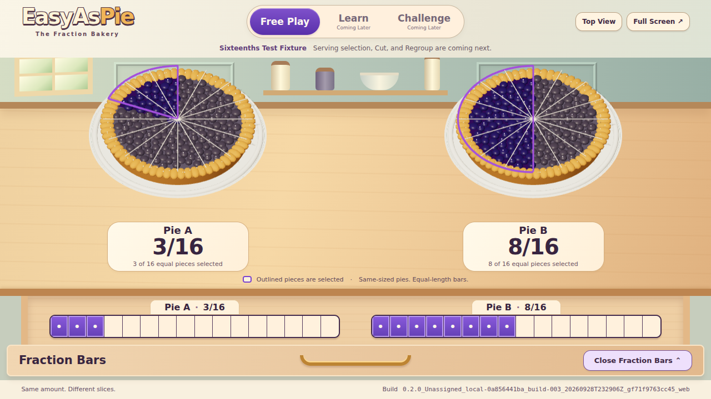

# Bakery Preview Review — Issue 10

## Scope And Reference Comparison

These are screenshots of the running build. The [saved Concept B image](../../mockups/paired-fraction-bars.png) is a mockup, not program output.

The preview retains two equal blueberry pies, golden scalloped crusts, cream fraction panels, berry-purple serving emphasis, compact modes, a warm kitchen/counter, and a wooden drawer with one matching bar per pie. Real modeled depth, shared orthographic projection, and equal countable cuts take priority over decoration.

Remaining visual differences: the quiet cabinetry, jars, and wood are lightweight CSS scenery; the pies are procedural stylized meshes, not the mockup's photographic pastry/fruit rendering. There are no countertop plants, loose berries, towels, or bowls of fruit. The camera is more mathematical and symmetric. Opening the drawer smoothly gives it space by reducing both pies' common display scale. The full build ID and explicit preview/Coming Later labels take screen space. Cut/Regroup controls are intentionally absent until #12. These are bounded visual differences, not dropped future interaction requirements.

## Evidence

Checked September 28, 2026 (America/New_York):

- `npm test`: **19/19 passed**. The added geometry test covers every valid serving, equal solid wedges, a common origin, unchanged whole dimensions, and empty/whole outlines.
- `npm run build` and `npm run check:build`: **passed**. Console, immutable artifact directory, manifest, bundled label, generated report, and the actual visible browser label agree.
- Browser harness: **passed** in Chromium 153 with WebGL 2 through SwiftShader. Both laptop sizes fit without horizontal or vertical overflow; both pies and the full selectable ID remain visible with the drawer open. Bars are equal-length and sixteenth segments are equal-width.
- Keyboard Tab/Enter/Space, visible focus, retained drawer focus, correct expanded/hidden/inert states, rapid drawer reversals, immediate reduced motion, Top/Angled View, full-screen entry/exit, viewport resize, and unchanged A/B fractions: **passed**.
- Final browser console warnings/errors and uncaught page errors: **none**. WebGL error code: **0**. An initial legacy shadow-mode warning was fixed before this run. The automatic browser download failed; an available local Chromium plus its software WebGL libraries enabled this real-browser check.
- `git diff --check`: **passed**. Existing deployment workflow, durable reservations, and build scripts are unchanged.

Exact local screenshot/review build:

`0.2.0_Unassigned_local-0a856441ba_build-003_20260928T232906Z_gf71f9763cc45_web`

Built from clean local implementation commit `f71f9763cc4540994ce14343022ae7e8e080097a`. The immutable output is `artifacts/<full ID>/` with `build.json` and `BUILD.md`; `dist/` is the identical preview copy. Later commits only record evidence. This is an explicitly local build, not a fabricated PR ordinal. The PR's Check And Deploy run supplies its separate downloadable CI review artifact; the PR description records its exact identity and run link. No review build was deployed.

**Limits:** This is a software-rendered headless browser, not a classroom laptop or projector. No target-device frame-rate guarantee or assistive-technology signoff is claimed. The pies render on demand (including resize during the drawer transition), rather than using a continuous animation loop. Real classroom rendering speed, projector contrast, and screen-reader behavior remain part of #13. The background is lightweight CSS scenery; the pies are actual Three.js solids. [Raw browser results](browser-results.json) record viewport geometry and the renderer used.

## Running-Build Screenshots

| View | Drawer Closed | Drawer Open |
| --- | --- | --- |
| 1366 × 768 | [Closed](1366x768-closed.png) | [Open](1366x768-open.png) |
| 1280 × 720 | [Closed](1280x720-closed.png) | [Open](1280x720-open.png) |

[Sixteenths Top View](1280x720-sixteenths-top.png) · [Default Top View](1280x720-top-view.png) · [Empty And Whole](1280x720-empty-whole.png) · [Empty And Whole Top View](1280x720-empty-whole-top.png)
