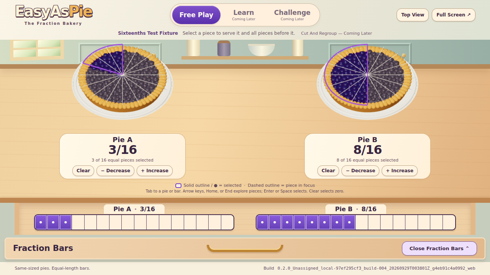
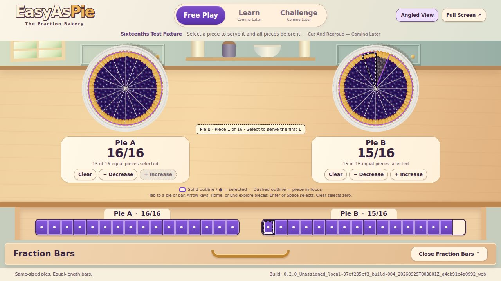

# Linked Selection Review — Issue 11

## Exact Review Build

`0.2.0_Unassigned_local-97ef295cf3_build-004_20260929T003801Z_g4eb91c4a0992_web`

These are actual screenshots of the running production artifact, built from clean local implementation commit `4eb91c4a09924d373a84c005836600282c238646`. The source tree is `cf7ec42e5224d0d3aa0d3c5acf2bb08641877973`; the following evidence commit adds only this review directory. The remote upload preserves those exact file contents. [Build Manifest](build.json) and [Generated Build Report](BUILD.md) retain the identity and source fingerprint. Console, immutable artifact folder, embedded manifest, visible/copyable footer, and report agree. CI creates its own PR-scoped review build; consult the PR for its exact artifact and check-run links. It is not the screenshot build or a deployment.

## Results

- `npm test`: **21/21 passed**, including exhaustive exact state/independence tests, durable build reservations, every piece interior and cut boundary, and all 34 rendered serving states with stable solid geometry.
- `npm run build`, `npm run check:build`, and `git diff --check`: **passed**.
- [Browser Results](browser-results.json): Chromium **153.0.8010.0**, WebGL 2 / SwiftShader; **577 activations**, **378 hover/focus checkpoints**, **240 near-boundary clicks**. These counters overlap: boundary clicks are included in activations. The final explicit keyboard boundary action is additionally verified without incrementing the activation counter.
- All **34 valid fractions per pair** (3 + 5 + 9 + 17), including zero through Clear, exercised via **pie pointer, bar pointer, pie keyboard, and bar keyboard**. Every check verifies both pairs' labels, selected pieces, canvas description, bar fraction, and disabled boundaries, so the unedited pair must remain unchanged.
- Both sides of every cut checked through halves, quarters, eighths, and sixteenths. First/last pieces, empty/whole, repeated activation, disabled controls, and alternating pairs passed. The browser used real mouse/keyboard events; no application test API selected a serving.
- Hover and arrow/Home/End movement never changed fractions; Enter/Space matched pointer selection. Corresponding pie/bar emphasis, explicit native-button names, visible keyboard focus, non-color patterns, and polite selection announcements were checked.
- Actual Tab order skips closed bars and visits one stop per pie/bar. Escape from either open bar restores toggle focus before hiding/inerting its region. Boundary serving buttons keep focus with enforced `aria-disabled` semantics.
- Drawer reversal, live selection during drawer motion, Top/Angled View, full-screen enter/exit, viewport resize, and reduced motion preserved synchronization. Reduced motion produced no drawer animation.
- Normal and sixteenth layouts fit **1366 × 768** and **1280 × 720**, open and closed, without either-axis overflow. Pies, controls, and complete build ID stay on screen; the bars and their subdivisions remain equal in length/width.
- **No browser warnings/errors or uncaught exceptions; WebGL error 0.**

## Visual Review

The accepted Step 02 bakery composition, equal wholes, common back-center origin, warm drawer, and prominent build footer remain. Serving controls fit below the fraction labels. The keyboard pie control is a visible named button when focused; its matching bar segment and 3D slice share dashed emphasis. A solid purple boundary and bar dots continue to mark the committed serving. Screenshot review caught and corrected light focus dashes initially hidden inside the dark backing; these final images show the corrected pattern.

| View | 1366 × 768 | 1280 × 720 |
| --- | --- | --- |
| Normal, Drawer Closed | [Screenshot](1366x768-normal-closed.png) | [Screenshot](1280x720-normal-closed.png) |
| Normal, Drawer Open | [Screenshot](1366x768-normal-open.png) | [Screenshot](1280x720-normal-open.png) |
| Normal, Keyboard Focus | [Screenshot](1366x768-normal-focus.png) | [Screenshot](1280x720-normal-focus.png) |
| Sixteenths, Drawer Closed | [Screenshot](1366x768-sixteenths-closed.png) | [Screenshot](1280x720-sixteenths-closed.png) |
| Sixteenths, Drawer Open | [Screenshot](1366x768-sixteenths-open.png) | [Screenshot](1280x720-sixteenths-open.png) |
| Sixteenths, Focus Without Selection | [Screenshot](1366x768-sixteenths-focus.png) | [Screenshot](1280x720-sixteenths-focus.png) |

[Empty And Whole](1280x720-empty-whole.png) · [Pie Keyboard Selection](1280x720-pie-keyboard.png)

## Reproduce And Limits

Build through `npm run build`, verify with `npm run check:build`, then run `node scripts/review-selection.mjs` using a separately installed Playwright. `PLAYWRIGHT_MODULE`, `CHROMIUM_PATH`, and `REVIEW_OUTPUT` can point to existing installations and a fresh output directory. The harness serves the immutable built contents locally, does not rebuild or deploy, and writes its build ID into the results. The original Step 02 harness/screenshots remain historical evidence.

This is a software-rendered headless Chromium review, not classroom hardware/projector or screen-reader signoff. No target-device frame rate is claimed. That integrated review remains #13. Cut/Regroup presentation remains #12; Learn/Challenge, scoring, comparison overlays, new recipes, and actual ruler activities remain outside this PR. The explicit denominator fixtures are starting conditions for review, not a denominator menu or saved progress.
