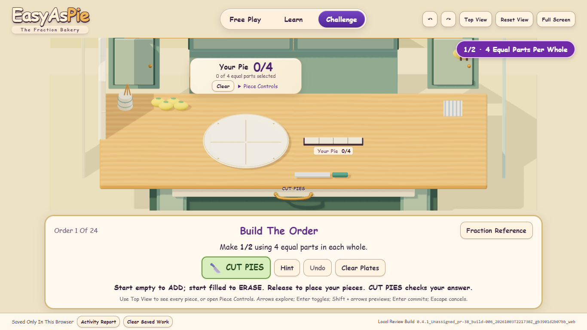
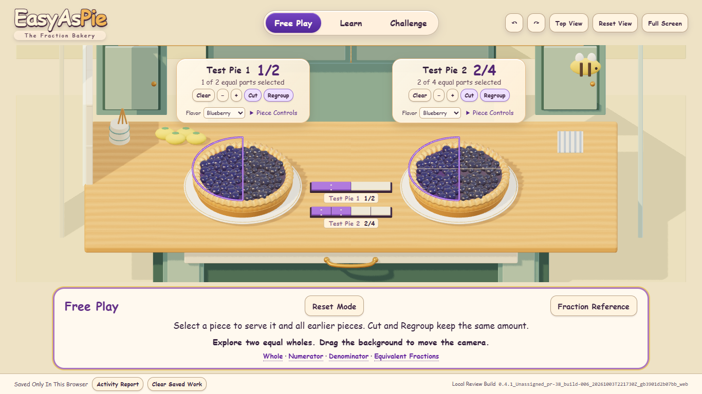

# Kitchen Viewport And Camera Diagnosis

[Follow-Up Issue #39](https://github.com/AbbyUsesAIThatCodes/EasyAsPie/issues/39). October 3, 2026 read-only review of the teacher's feedback after mechanics acceptance. The teacher again approved the worksheet. Its PR #38 build 006 instructional baseline stays frozen; these observations do not hold up materials.

## Which Build Was Inspected

Port **4216** serves `0.4.1_Unassigned_pr-38_build-006_20261003T221730Z_gb3901d2b07bb_web`. The HTTP manifest and visible footer agree: runtime `b3901d2b07bbc31380b1d1cb027b1aa3d087b6d1`, accepted evidence `dcc9bb7c762d5bdc557249903b8d6c08e5238ef5`, acceptance documentation `5a1977958a607ce1f6514f7b16075201ad381516`.

Port **4201** still serves `0.4.1_Unassigned_local-5bcdfdbd84_build-007_20261003T181423Z_g36e3b7cdea4e_web`. It is the preserved earlier beginner review, not PR #38 build 006.

These screenshots and DOM/camera measurements came from fresh isolated Chromium contexts with reduced motion. They did not capture or change the teacher's existing browser tab or saved work. The desktop-inspection runtime was unavailable. The exact URL/footer of the teacher's reported tab therefore remains unconfirmed; do not describe that tab as verified build 006. Both local builds reproduce the letterboxing.

## Findings And Evidence

| Viewport / Mode | Canvas Height | Viewport Used | Instruction Panel Height |
| --- | --- | --- | --- |
| 1280 × 720 / Challenge | 356.6 px | 49.5% | 220.0 px |
| 1366 × 768 / Learn Or Challenge | 402.0 px | 52.3% | 220.0 px |
| 1920 × 1080 / Challenge | 713.0 px | 66.0% | 220.0 px |
| 1366 × 768 / Free Play | 462.4 px | 60.2% | 159.6 px |

The canvas begins below an approximately 88 px header reservation at 1366 × 768. The header computes transparent; the solid-looking strip is the app background exposed because the canvas does not render there. `src/beginner.css` removes header, activity and footer heights from the canvas. `fitPanels()` in `src/beginner-main.js` supplies the measurements. The large opaque bottom panel and its surrounding reserved strip account for most remaining lost scene height. This is confirmed usable-space/layout feedback, although the observed controls remain accessible and no new mechanics failure was demonstrated.

Camera button input reaches **±0.48 rad / ±27.5° yaw**; tilt offsets clamp to **−0.12/+0.26 rad**. The limits and orthographic framing formula match the preserved build-007 source. Thus restriction is confirmed, but a new tightening in build 006 is not. There is no pan, zoom or unrestricted look control. Background dragging changes the tilt; Top View and Reset View remain available.

The side walls at x=±9.5 are only approximately **0.67 world unit** outside the 17.5-unit counter's edges. Their foreground ends intrude at allowed orbit extremes. The rear wall is already at z=−12; the earlier cabinet/plate clearance correction did not finish or widen the kitchen.

[Left Limit](pr38-build006-left-limit.png) · [Right Limit](pr38-build006-right-limit.png) · [Tilt Limit](pr38-build006-tilt-limit.png)

The physical bee remains at (7.7, 1.8, −5), made from a flattened sphere body, projecting stripe boxes and small sphere wings. Its retained awkward 3D form is visible in Free Play. The teacher described it as giant/distorted; the giant scale in their exact unseen state was not independently reproduced.

[Learn](pr38-build006-learn-1366.png) · [1280 × 720](pr38-build006-challenge-1280.png) · [1920 × 1080](pr38-build006-challenge-1920.png) · [Preserved Build 007](preserved-build007-challenge-1366.png) · [Raw Manifests, DOM And Camera Measurements](inspection.json)

No page errors occurred. This inspection did not rerun the full gameplay suites or constitute classroom-device acceptance. Existing 006 mechanics evidence remains valid for its unchanged artifact.

## Tiny Separate Corrective Scope

1. Render the kitchen background behind the floating header, and reflow excessive guidance-panel spacing without changing wording, lesson labels, readable font sizes or reachable feedback/controls. Keep the pies and bars clear of overlays. Changing opacity alone will not restore the missing canvas area.
2. Remove the malformed physical bee in the separate visual review; keep illustrated wallpaper replacement deferred.
3. Consider a modest orbit increase only after the new viewport and wall ends are checked. Adjust offending side-wall clearance only if required for those bounds. Retest cards, bars, hit targets, equal wholes and incoming plate paths; do not widen clamps blindly.

The full enclosure, higher ceiling/fan, illustrated lemon-vine/bee wallpaper and broad room refinement were already deferred. Strawberry pie, peach cobbler and other flavor ideas are recorded as future stretch work; no flavors are added or removed here. The existing Strawberry option in Free Play is preserved and is not a new completed stretch item.

No source, CSS, artifact, preview-server or saved-state change is made by this diagnosis. A later correction needs a separate identified review build and tests at laptop/portrait sizes, all three modes, one/two plates, open native controls/reference/drawer, orbit/reset/top views, camera-versus-piece gestures and serving transitions. Do not replace accepted port 4216 or its ZIP. Keep worksheet mechanics/labels, fractions, tasks, saves/reports and reduced-motion behavior fixed. Main/live, draft PRs #28–#30, PR #38 and #13's pending hardware review remain unchanged.
